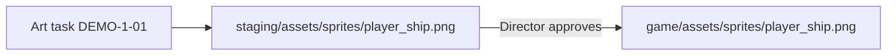

# Player ship
Version: 0
Status: draft
Features: DEMO-1

## Purpose
Defines the look of the player ship as one still image. It carries no movement, hitbox or loading rules. Those belong to later features.

## Diagram


## Interface
Asset spec, not code.
```
file:        player_ship.png
staged at:   staging/assets/sprites/player_ship.png
shipped at:  game/assets/sprites/player_ship.png   (only after Director approval)
format:      PNG, with alpha channel
size:        100 x 100 px
background:  fully transparent
orientation: nose points up
frames:      1 (no animation, no variants)
```

## Rules
- Image is 100x100 px. Source: Director, in the DEMO-1 request (scope report, Values needed).
- Nose points up, background transparent, one still image. Source: scope report DEMO-1, Limits.
- No animation, extra frames, thrust or damage variants. Source: scope report DEMO-1, Limits (Out).
- No hitbox is defined here. Source: scope report DEMO-1, Limits (Out).
- The image is not loaded by any game code in this feature. Source: scope report DEMO-1, Limits (Out).
- The asset stays in staging until the Director names it as approved. Source: art-audio-engineer definition, Approval.
- Art style and palette: open question for the Director. The GDD has no art style (`docs/design/gdd/` is empty).

## Rationale
- No code or hitbox is described because the scope report excludes both. A later feature will define them.
- The ship is defined by its role (player vessel, nose up), not by a fixed look, so the style can be set by the Director without changing this contract.
