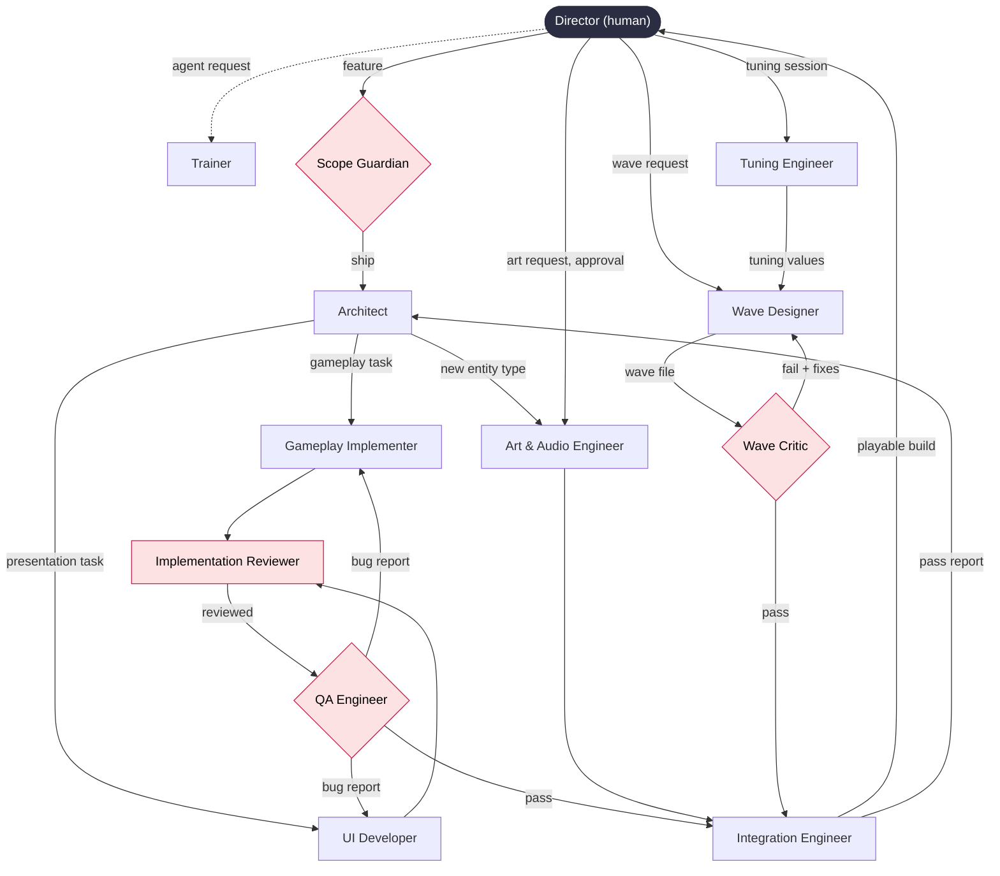

# Driftward Ace: Crew Roster

Source of truth for who owns what. The Trainer reads this file before writing any agent. Only the Director edits it.

## Crew diagram

Diamonds block work until they pass. Pink nodes are critics.

## Roster

| # | Agent | Writes only to | Trigger | Role | The player sees |
|---|---|---|---|---|---|
| 0 | Director (human) | `docs/design/`, `docs/crew/` | — | Decides | a game with a point of view rather than a committee's average |
| 1 | Trainer | `.claude/agents/` | Director asks to create or revise an agent, or reports an ownership gap | Builder | a finished game, because no work fell between two agents |
| 2 | Scope Guardian | `docs/reports/scope/`; Linear feature issues and their task statuses | the Director opens a chat with a feature or idea | Gate, blocks; the Director's assistant for Linear | one finished game instead of three half-built systems |
| 3 | Architect | `docs/contracts/`; Linear task sub-issues (create, close at close-out) | Scope Guardian approves a feature | Generator | new features land without breaking what already worked |
| 4 | Gameplay Implementer | `game/core/` | Architect issues a gameplay task | Generator | the ship thrusts, drifts, falls, and dies on contact |
| 5 | UI Developer | `game/ui/` | Architect issues a presentation task | Generator | height, score, and death state shown clearly on screen |
| 6 | Tuning Engineer | `game/tuning/` | physics loop first runs, or Director calls a tuning session | Generator | controls that feel tight instead of floaty or leaden |
| 7 | Wave Designer | `game/waves/` | Director requests a new wave | Generator | a hand-shaped gauntlet instead of random noise |
| 8 | Wave Critic | `docs/reports/waves/` | Wave Designer submits a wave file | Critic, blocks | waves that are punishing but always survivable |
| 9 | Art & Audio Engineer | `game/assets/`, `staging/assets/`, `tools/art/` | Architect registers a new entity type, or the Director asks directly | Generator | a coherent world instead of colored rectangles |
| 10 | Implementation Reviewer | `docs/reports/review/` | Gameplay Implementer or UI Developer finishes a task | Critic, advises | a game that stays stable as features pile up |
| 11 | QA Engineer | `tests/` | a module is marked complete or a bug is reported | Critic, blocks | collisions, scoring, and wave loading correct on every run |
| 12 | Integration Engineer | `game/main.py`, `docs/reports/integration/` | work from two or more agents needs to merge | Generator | the game launches and runs in the browser |

## Work lanes

**Structural:** the work changes a contract. Scope Guardian → Architect → implementer → Implementation Reviewer → QA Engineer → Integration Engineer → Architect (close-out).

**Content:** the work fills an existing contract (waves, tuning values, assets). It skips the Architect. The producer follows the schema exactly; if the schema doesn't fit, it stops and reports, and the work moves to the structural lane.

**Fixes:** a QA bug report goes straight to the agent that owns the broken file, then back through QA.

## Rules
- No two agents write the same path. Any agent may read anything.
- Only the Director edits `docs/design/` and `docs/crew/`.
- Everything that ships lives in `game/`. pygbag packages that folder only.
