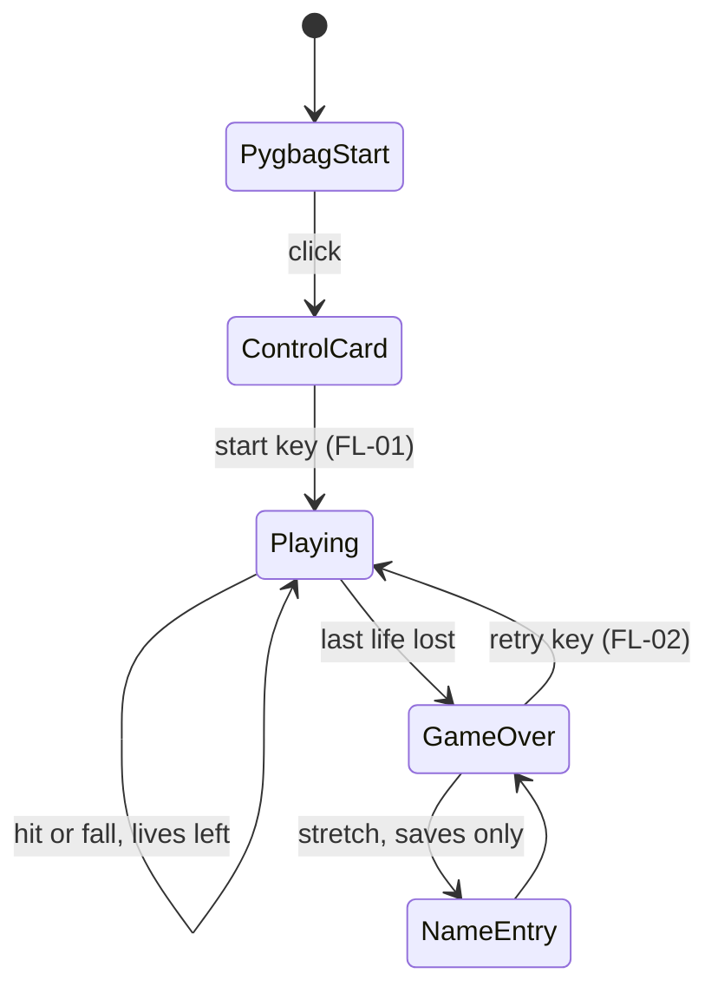

# Game flow
Status: draft
Depends on: [05-lives-and-damage.md](05-lives-and-damage.md), [10-ui.md](10-ui.md), [11-save-data.md](11-save-data.md)

## Summary
The game moves through a few fixed states. pygbag's own click-to-start screen comes first and unlocks audio. Then the control card shows. Then the run plays until lives hit zero, the game-over screen shows, and one key starts a new run.

## Values
| Key | Value | Unit | Range | Status | Source |
|---|---|---|---|---|---|
| start_key | TBD | — | — | TBD | FL-01 |
| retry_key | TBD | — | — | TBD | FL-02 |
| retry_delay | TBD | ticks | — | TBD | FL-02 |

## Rules
1. **PygbagStart.** pygbag's built-in click-to-start screen. Never build a custom one. Source: [15-tech-constraints.md](15-tech-constraints.md).
2. **ControlCard.** Shows once after the click, before the first run. Content is in [10-ui.md](10-ui.md). Source: [01-vision.md](01-vision.md), Locked decisions.
3. **Playing.** Every run starts the same way: 3 lives, score 0, Level 1, Wave 0. See [05-lives-and-damage.md](05-lives-and-damage.md) and [09-waves.md](09-waves.md).
4. A hit or a fall inside Playing costs a life. The game stays in Playing. Invulnerability and the fall respawn happen inside it ([05-lives-and-damage.md](05-lives-and-damage.md)).
5. **GameOver.** Entered the tick the last life is lost. Shows the final score. Content is in [10-ui.md](10-ui.md).
6. **Retry.** One key starts a new run from rule 3. The control card doesn't show again.
7. **NameEntry** exists only when saves ship. See [11-save-data.md](11-save-data.md).

## Edge cases
- The player is holding an arrow key when the last life is lost. A retry on an arrow key could skip the game-over screen at once. See FL-02.
- The browser tab loses focus during play. See FL-04.

## Open
- FL-01, FL-02, FL-03, FL-04.

## How to extend
A new screen (pause, settings) is a new state. Add it to the diagram and rules, give it its key in Values, and check the key against "arrow keys only" in [01-vision.md](01-vision.md).
